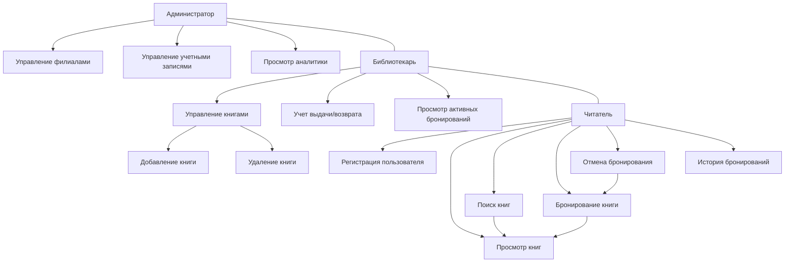

```mermaid
flowchart TD
    %% Акторлар
    Reader[Читатель]
    Librarian[Библиотекарь]
    Admin[Администратор]

    %% Use Cases
    UC_Register["Регистрация пользователя"]
    UC_View["Просмотр книг"]
    UC_Search["Поиск книг"]
    UC_Book["Бронирование книги"]
    UC_Cancel["Отмена бронирования"]
    UC_History["История бронирований"]
    UC_BookManage["Управление книгами"]
    UC_Add["Добавление книги"]
    UC_Delete["Удаление книги"]
    UC_Issue["Учет выдачи/возврата"]
    UC_Active["Просмотр активных бронирований"]
    UC_Branch["Управление филиалами"]
    UC_Users["Управление учетными записями"]
    UC_Analytics["Просмотр аналитики"]

    %% Связи акторов с Use Case
    Reader --> UC_Register
    Reader --> UC_View
    Reader --> UC_Search
    Reader --> UC_Book
    Reader --> UC_Cancel
    Reader --> UC_History

    Librarian --> UC_BookManage
    Librarian --> UC_Issue
    Librarian --> UC_Active

    Admin --> UC_Branch
    Admin --> UC_Users
    Admin --> UC_Analytics

    %% Включения / расширения
    UC_Search --> UC_View
    UC_Book --> UC_View
    UC_Cancel --> UC_Book

    UC_BookManage --> UC_Add
    UC_BookManage --> UC_Delete

    %% Иерархия ролей (только для визуального представления)
    Librarian --- Reader
    Admin --- Librarian

```
