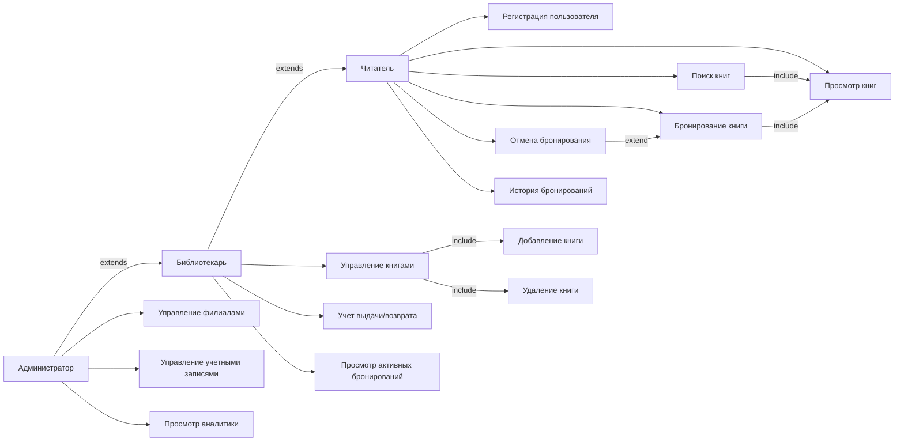

```mermaid
%% Use Case диаграммасы - толық жұмыс жасайтын формат
graph LR
    %% Актерлер
    Reader["Читатель"]
    Librarian["Библиотекарь"]
    Admin["Администратор"]

    %% Use Case-тер
    UC_Register["Регистрация пользователя"]
    UC_View["Просмотр книг"]
    UC_Search["Поиск книг"]
    UC_Book["Бронирование книги"]
    UC_Cancel["Отмена бронирования"]
    UC_History["История бронирований"]

    UC_BookManage["Управление книгами"]
    UC_Add["Добавление книги"]
    UC_Delete["Удаление книги"]
    UC_Issue["Учет выдачи/возврата"]
    UC_Active["Просмотр активных бронирований"]

    UC_Branch["Управление филиалами"]
    UC_Users["Управление учетными записями"]
    UC_Analytics["Просмотр аналитики"]

    %% Мұрагерлік
    Librarian -->|extends| Reader
    Admin -->|extends| Librarian

    %% Актерлер мен Use Case байланысы
    Reader --> UC_Register
    Reader --> UC_View
    Reader --> UC_Search
    Reader --> UC_Book
    Reader --> UC_Cancel
    Reader --> UC_History

    Librarian --> UC_BookManage
    Librarian --> UC_Issue
    Librarian --> UC_Active

    Admin --> UC_Branch
    Admin --> UC_Users
    Admin --> UC_Analytics

    %% Use Case арасындағы қатынастар
    UC_Search -->|include| UC_View
    UC_Book -->|include| UC_View
    UC_Cancel -->|extend| UC_Book

    UC_BookManage -->|include| UC_Add
    UC_BookManage -->|include| UC_Delete

```
